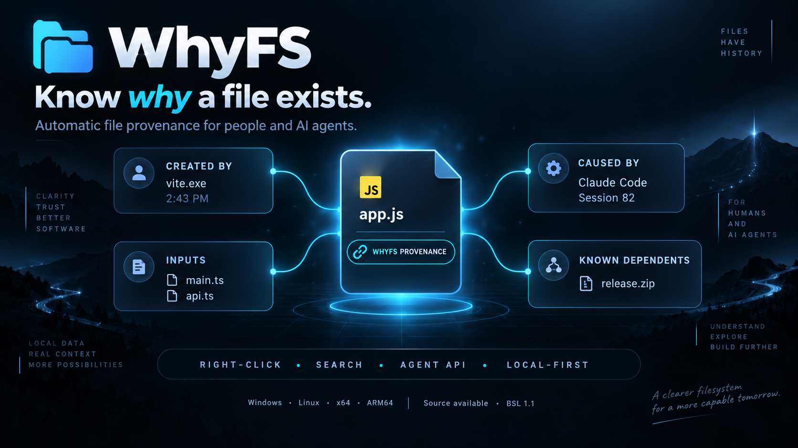
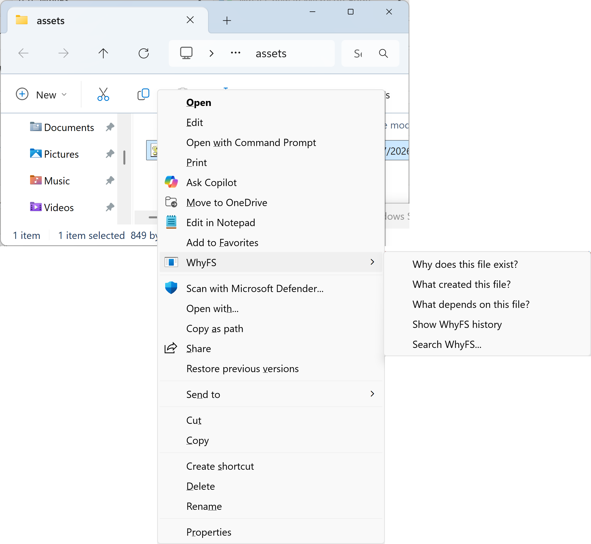
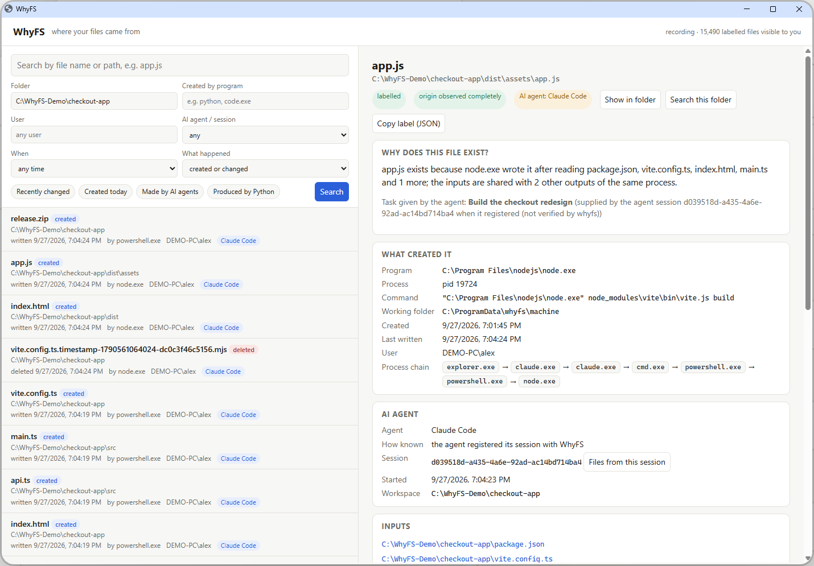

<p align="center"></p>

# WhyFS

**Know why a file exists.**

WhyFS automatically labels files with their provenance: what created them, when, how, and
which inputs contributed.  When that context is reliably known, it also records which person or
software agent caused the activity.

Install it once.  WhyFS runs locally in the background.  Every file you create or change gets
an external provenance label, without touching the file.

- **Local-first.**  No cloud, no account, no telemetry.
- **Files are never modified**, and **file contents are never read**.
- **Uncertainty is explicit.**  When WhyFS was not watching, or lost events, the label says so.
- **AI is optional.**  WhyFS works without any AI; AI agents are simply clients that can ask it.
- **Source available** under the Business Source License 1.1.

> **Status: 1.0 release candidate, public development.**  No installer or package has been
> published yet; build them from source (below).  What has and has not been validated, per
> platform, is in [PROJECT_STATUS.md](PROJECT_STATUS.md) and
> [docs/PLATFORM_VALIDATION.md](docs/PLATFORM_VALIDATION.md).

## Right-click a file

<p align="center"></p>

On Windows, right-click any file and choose **WhyFS** (Windows 11: *Show more options*):
- **Why does this file exist?**
- **What created this file?**
- **What depends on this file?**
- **Show WhyFS history**

Linux file managers get the same menu: Files (Nautilus), Dolphin and Nemo.

## Search and read labels

<p align="center"></p>

Open **WhyFS** from the Start or application menu to search every labelled file by:
- name or folder;
- the program that wrote it;
- user;
- AI agent or agent session;
- time;
- whether it was created, changed or deleted.

The window is a small local page in your browser.  It is served on `127.0.0.1` only, for you
only, and it is read-only.

A label answers, where evidence exists:
- **What and where:** the file, and its path.
- **When:** created and last written.
- **What and who:** the process that wrote it, the chain of programs that led to it, and the
  user.
- **Which AI agent session caused it.**  WhyFS says this only when it is known: either the
  agent registered its session, or WhyFS recognised a known agent's program.  A task appears
  only if the agent supplied one, and WhyFS never guesses intent.
- **Which inputs contributed**, and **what has happened to the file since**.
- **What depends on it, and what happens if you remove or change it.**  This comes from
  observed activity.  WhyFS never claims a file is safe to delete.
- **Whether the evidence is complete**, or WhyFS was not recording, or lost events.

## For AI agents and tools

Agents should ask WhyFS instead of guessing.  The local API speaks one JSON request and reply
per line over:
- Linux: `/run/whyfs/api.sock`;
- Windows: `\\.\pipe\whyfs-api`.

Each caller sees only its own processes' evidence.

```json
{"v": 1, "op": "get_file_provenance", "params": {"path": "C:\\Projects\\App\\dist\\app.js"}}
```

Before editing, deleting or attributing a file, an agent can check:
- whether the file is generated (`impact.is_generated`);
- its source `inputs`;
- its known dependents (`impact`);
- which agent session made it (`agent`);
- whether the provenance is complete (`observation`).

Other operations: `search_files`, `list_agent_sessions`, `get_file_history`,
`get_files_by_agent` and `get_recent_changes`.  Agents can register their session, with an
optional task description, so the files they cause are attributed to it.  See
[docs/AGENT_PROTOCOL.md](docs/AGENT_PROTOCOL.md).

## Command line

```bash
whyfs label FILE [--json]          # the provenance label
whyfs search app.js                # --under DIR --creator python --agent "Claude Code" --since today
whyfs why | history | impact FILE  # creator and inputs / what happened / what was built from it
whyfs ui [--file FILE]             # open the WhyFS window
whyfs status                       # what WhyFS records, recording gaps, store size, retention
```

## Install

| Platform | Package | Notes |
|---|---|---|
| Windows 11 x64 or ARM64; Windows Server 2022 x64 | `whyfs-1.0.0-x64.msi`, `whyfs-1.0.0-arm64.msi` | Run once as an administrator.  The `whyfs` service starts at once and with Windows.  Everything after that works as a normal user. |
| Linux x86-64 or ARM64 (Debian/Ubuntu) | `whyfs_1.0.0_amd64.deb`, `whyfs_1.0.0_arm64.deb` | `sudo apt install ./whyfs_1.0.0_<arch>.deb`.  `whyfs.service` starts at once and at every boot.  Check the kernel with `whyfs doctor`. |
| WSL2 | the Linux package | Labels Linux-side activity.  Enable systemd in `/etc/wsl.conf`, or run `sudo whyfs machine run`. |

No packages are published yet.  Build them from source:
- **Linux:** `bash packaging/linux/build_deb.sh dist` (on the target architecture);
- **Windows:** `native\windows\build.ps1`, then `native\windows\make_msi.py` (see
  `.github/workflows/native-validation.yml` for the exact commands).

The packages are not code-signed.  Windows 10 has not been validated separately.  **macOS is not supported**; it is a possible
future or community target.  Validation evidence
for every platform is in [docs/PLATFORM_VALIDATION.md](docs/PLATFORM_VALIDATION.md).

## Privacy and storage

- **Local only.**  The store is readable only by the service, and each user sees only their
  own activity.  An administrator sees all.
- **Secrets are redacted before storage.**  This covers secrets on command lines, including
  inside shell wrappers (`--token x`, `API_KEY=x`, `cmd /c "…"`, PowerShell `$env:…`), and in
  agent task text.
- **You control what is kept.**
  - Exclude paths or programs in `scope.conf`.
  - Creation records are kept for 365 days and reads for 30 days, under a 2 GiB cap.
  - `whyfs forget PATH | --everything` deletes records.

See [SECURITY.md](SECURITY.md) and [docs/MACHINE_MODE.md](docs/MACHINE_MODE.md).

## When WhyFS was not watching

WhyFS starts with the operating system and restarts itself after a crash.  Downtime and lost
events are recorded.

A file that appeared while WhyFS was not recording is never given an invented creator.  Its
label says that its origin is unknown, and that it appeared during a gap.  Details:
[docs/HUMAN_INTERFACE.md](docs/HUMAN_INTERFACE.md#observation-gaps).

## Documentation

- [How it works](docs/ARCHITECTURE.md)
- [Human interface](docs/HUMAN_INTERFACE.md)
- [Agent protocol](docs/AGENT_PROTOCOL.md)
- [Machine-wide labels](docs/MACHINE_MODE.md)
- [Schema](docs/SCHEMA.md)
- [Platform validation](docs/PLATFORM_VALIDATION.md)
- [Known limitations](docs/KNOWN_LIMITATIONS.md)
- [Changelog](CHANGELOG.md) and [1.0.0 release notes](docs/RELEASE_NOTES_1.0.0.md)
- [Release artifacts and hashes](docs/RELEASE_ARTIFACTS.md)
- [Security](SECURITY.md)
- [Contributing](CONTRIBUTING.md)

## License

WhyFS is **source available under the Business Source License 1.1** ([LICENSE](LICENSE)).  It is
not OSI-approved open source.

- **Anyone** may copy, modify, redistribute and make **non-production** use of WhyFS.  That
  includes evaluation, testing and development, by businesses too.
- **Free production use** covers two cases:
  - personal, non-commercial use by an individual on devices they own or control;
  - non-commercial teaching, learning and research at accredited educational institutions.
- **Commercial production use** needs a commercial license from the first production deployment:
  - use by or on behalf of a business or other for-profit organization;
  - WhyFS as part of a product, appliance, managed service or agent platform.

  Contact licensing@tenzorpipe.org.
- **Change to Apache 2.0.**  WhyFS 1.0.0 becomes available under the Apache License 2.0 on its
  Change Date, **2030-09-28**.  Each later version states its own Change Date.
